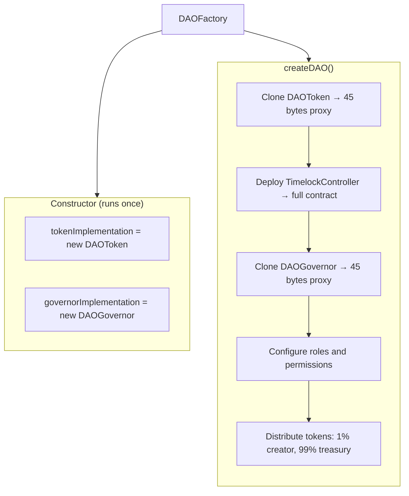

Source: [`contracts/DAOFactory.sol`](https://github.com/createDAO/v2-core)

The `DAOFactory` is the central deployment contract for CreateDAO v2. It deploys complete DAO governance systems using the **EIP-1167 minimal proxy (Clones) pattern** for gas efficiency.

## Overview

The factory contains implementation contracts for DAOToken and DAOGovernor, deployed once in the constructor. When creating a new DAO, it clones these implementations and deploys a fresh TimelockController, configuring all three contracts to work together as a complete governance system.

## Key Concepts

### EIP-1167 Minimal Proxies (Clones)

Instead of deploying full contract bytecode for each DAO, the factory uses OpenZeppelin's `Clones` library to create minimal proxy contracts (only 45 bytes each!) that delegate all calls to shared implementation contracts.

**Benefits:**
- **Massive Gas Savings**: Each proxy is only 45 bytes vs ~15KB+ for full contracts
- **Factory Size**: Keeps factory under the 24KB contract size limit
- **Immutable**: Proxies are not upgradeable - they permanently point to their implementation
- **Identical Behavior**: Function identically to full contracts

### Deterministic Deployment (CREATE2)

The factory itself is deployed using Arachnid's deterministic CREATE2 deployer, which means:
- **Same address across chains** when using the same salt
- **Predictable addresses** before deployment
- **Easy multi-chain deployment**

## Architecture



## Key Functions

### `createDAO`

```solidity
function createDAO(
    string memory daoName,
    string memory tokenName,
    string memory tokenSymbol,
    uint256 totalSupply,
    uint48 votingDelay,
    uint32 votingPeriod
) external returns (
    address token,
    address timelock,
    address governor
);
```

Deploys a complete DAO system in a single transaction.

**Parameters:**
- `daoName`: Name of the DAO (used for Governor)
- `tokenName`: Name of the governance token (e.g., "My DAO Token")
- `tokenSymbol`: Token symbol (e.g., "MYD")
- `totalSupply`: Total token supply in wei (e.g., `1000000 * 10^18` for 1M tokens)
- `votingDelay`: Delay before voting starts (seconds, e.g., `86400` = 1 day)
- `votingPeriod`: Duration of voting period (seconds, e.g., `604800` = 1 week)

**Returns:**
- `token`: Address of the DAOToken proxy
- `timelock`: Address of the TimelockController (treasury)
- `governor`: Address of the DAOGovernor proxy

**Process:**

1. **Clone DAOToken** (EIP-1167)
   - Creates minimal proxy pointing to `tokenImplementation`
   - Initializes with name, symbol, and total supply
   - Mints all tokens to the factory temporarily

2. **Deploy TimelockController**
   - Creates full contract (not a proxy)
   - Sets 1-day minimum delay
   - Executors: `address(0)` (anyone can execute after delay)
   - Admin: factory (temporarily, revoked later)

3. **Clone DAOGovernor** (EIP-1167)
   - Creates minimal proxy pointing to `governorImplementation`
   - Initializes with name, token address, and timelock address
   - Sets initial manager to `msg.sender` (DAO creator)
   - Configures voting delay, voting period, quorum (1%), and proposal threshold (1%)

4. **Configure Roles**
   - Grants `PROPOSER_ROLE` to Governor (only Governor can propose timelock actions)
   - Grants `CANCELLER_ROLE` to Governor
   - Revokes `ADMIN_ROLE` from factory (Governor becomes sole admin via timelock)

5. **Distribute Tokens**
   - Transfers 1% to `msg.sender` (creator) - auto-delegated
   - Transfers 99% to timelock (treasury)

6. **Record & Emit**
   - Stores DAO info in `daos` array
   - Emits `DAOCreated` event

### View Functions

#### `getDAOCount`
```solidity
function getDAOCount() external view returns (uint256);
```
Returns the total number of DAOs created by this factory.

#### `getDAOByIndex`
```solidity
function getDAOByIndex(uint256 index) external view returns (DAOInfo memory);
```
Returns information about a specific DAO by its index.

**Returns:** `DAOInfo` struct containing:
- `name`: DAO name
- `token`: Token address
- `governor`: Governor address
- `timelock`: Timelock address
- `creator`: Address that created the DAO
- `createdAt`: Timestamp of creation

#### `getImplementations`
```solidity
function getImplementations() external view returns (
    address tokenImpl,
    address governorImpl
);
```
Returns the addresses of the implementation contracts used for cloning.

## Events

### `DAOCreated`

```solidity
event DAOCreated(
    address indexed creator,
    address indexed token,
    address indexed governor,
    address timelock,
    string name,
    uint256 totalSupply
);
```

Emitted when a new DAO is successfully created.

## Token Distribution

When a DAO is created, tokens are distributed as follows:

| Recipient | Percentage | Purpose |
|-----------|-----------|---------|
| Creator (`msg.sender`) | 1% | Bootstrap governance - enables meeting quorum and creating initial proposals |
| Treasury (TimelockController) | 99% | Secure storage - distributed through governance proposals |

The 1% allocation is carefully chosen because:
- OpenZeppelin's `GovernorVotesQuorumFraction` requires minimum 1% quorum
- Creator needs exactly 1% to meet quorum and pass initial proposals
- After initial setup, creator can propose token distribution to other members

## Auto-Delegation

DAOToken implements auto-delegation, which means:
- When an address receives tokens **for the first time**, they automatically delegate to themselves
- Voting power is immediately active - no manual `delegate()` call needed
- This applies to the creator and all future token recipients

## Manager Role

The DAOGovernor contract includes a special `manager` address:
- **Initial Value**: Set to the DAO creator (`msg.sender`)
- **Purpose**: On-chain authorization for off-chain operations
- **How to Change**: Only through governance proposals (timelock-protected)
- **Use Case**: Integration with DAO management platforms like [OpenBook](https://openbook.so)

Backend systems can query the manager address:
```solidity
address currentManager = governor.manager();
```

And verify authorization:
```javascript
if (requestingWallet !== currentManager) {
    throw new Error("Not authorized");
}
```

## Gas Optimization

The Clones pattern provides significant gas savings:

| Component | Traditional Deployment | With Clones | Savings |
|-----------|----------------------|-------------|---------|
| DAOToken | ~2.5M gas | ~150K gas | **94%** |
| DAOGovernor | ~4M gas | ~200K gas | **95%** |
| **Total DAO** | **~8M gas** | **~2.5M gas** | **69%** |

## Example Usage

```javascript
import { ethers } from 'ethers';

// Connect to factory
const factory = await ethers.getContractAt(
    "DAOFactory",
    "0xd141662F4b788F28B2a0769a6d3f243D046B571f" // Base mainnet
);

// Create a DAO
const tx = await factory.createDAO(
    "My Community DAO",                    // daoName
    "My Community Token",                  // tokenName
    "MCT",                                 // tokenSymbol
    ethers.parseEther("1000000"),          // 1M tokens
    86400,                                 // 1 day voting delay
    604800                                 // 1 week voting period
);

const receipt = await tx.wait();

// Parse the DAOCreated event
const event = receipt.logs.find(
    log => log.fragment?.name === 'DAOCreated'
);

console.log("Token:", event.args.token);
console.log("Governor:", event.args.governor);
console.log("Timelock:", event.args.timelock);
```

## Security Considerations

1. **Immutable Proxies**: The clones are not upgradeable. Once deployed, they always point to the same implementation.

2. **Implementation Protection**: Implementation contracts call `_disableInitializers()` in their constructor, preventing anyone from initializing them directly.

3. **Role Configuration**: The factory carefully configures timelock roles and revokes its own admin access, ensuring only the Governor can control the timelock.

4. **Deterministic Addresses**: Using CREATE2 for factory deployment enables verification of factory authenticity across chains.

## Deployed Addresses

See the [Deployed Contracts](/deployed-contracts) page for factory addresses on all supported networks.

## Source Code

View the complete source code on GitHub:
- [DAOFactory.sol](https://github.com/createDAO/v2-core/blob/main/contracts/DAOFactory.sol)
- [DAOToken.sol](https://github.com/createDAO/v2-core/blob/main/contracts/DAOToken.sol)
- [DAOGovernor.sol](https://github.com/createDAO/v2-core/blob/main/contracts/DAOGovernor.sol)
