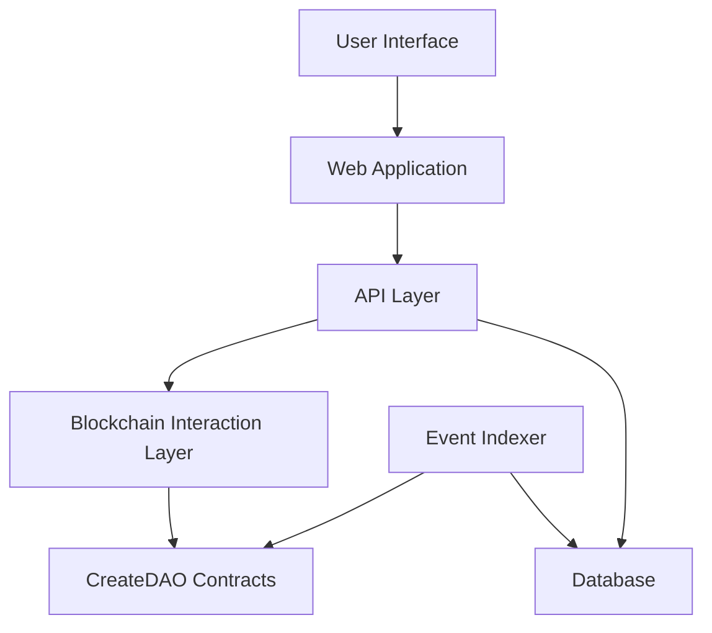

# Building a DAO Management Platform

This guide provides a comprehensive overview of how to build a DAO management platform similar to [dao.cafe](https://dao.cafe). It covers architecture, backend and frontend implementation, user experience considerations, and deployment strategies.

## Architecture Overview

A DAO management platform needs to interact with CreateDAO contracts, index events, store data, and provide a user-friendly interface. Here's a high-level architecture:



### Key Components

1. **User Interface**: React/Next.js frontend with wallet connection
2. **API Layer**: REST or GraphQL API for data access
3. **Blockchain Interaction Layer**: Viem or ethers.js for contract interaction
4. **Database**: For storing indexed events and platform-specific data
5. **Event Indexer**: Service that listens for contract events and indexes them

### Technology Stack Recommendations

- **Frontend**: Next.js, React, TailwindCSS
- **Backend**: Node.js, Express or NestJS
- **Database**: PostgreSQL for relational data, Redis for caching
- **Blockchain Interaction**: Viem or ethers.js
- **Indexing**: Custom indexer or TheGraph
- **Hosting**: Vercel for frontend, AWS/GCP for backend services

## Backend Implementation

### Contract Event Indexing

To keep your platform in sync with on-chain data, you need to index events from CreateDAO contracts:

```typescript
import { ethers } from 'ethers';
import { DAO_ABI } from './abis';

async function indexDAOEvents(daoAddress, provider) {
  const daoContract = new ethers.Contract(daoAddress, DAO_ABI, provider);
  
  // Listen for new proposals
  daoContract.on('ProposalCreated', async (proposalId, proposer, description, event) => {
    // Store proposal in database
    await storeProposal({
      proposalId: proposalId.toString(),
      proposer,
      description,
      blockNumber: event.blockNumber,
      timestamp: (await provider.getBlock(event.blockNumber)).timestamp,
      daoAddress
    });
  });
  
  // Listen for votes
  daoContract.on('Voted', async (voter, proposalId, support, weight, event) => {
    // Store vote in database
    await storeVote({
      voter,
      proposalId: proposalId.toString(),
      support,
      weight: weight.toString(),
      blockNumber: event.blockNumber,
      timestamp: (await provider.getBlock(event.blockNumber)).timestamp,
      daoAddress
    });
  });
  
  // Listen for proposal execution
  daoContract.on('ProposalExecuted', async (proposalId, event) => {
    // Update proposal status in database
    await updateProposalStatus(proposalId.toString(), 'executed');
  });
}
```

### Database Design

Your database should store the following entities:

1. **DAOs**: Information about deployed DAOs
2. **Proposals**: All proposals created in each DAO
3. **Votes**: All votes cast on proposals
4. **Users**: Information about users who interact with the platform
5. **Transactions**: Record of transactions initiated through the platform

Example schema for a PostgreSQL database:

```sql
CREATE TABLE daos (
  address VARCHAR(42) PRIMARY KEY,
  name VARCHAR(255) NOT NULL,
  token_address VARCHAR(42) NOT NULL,
  treasury_address VARCHAR(42) NOT NULL,
  staking_address VARCHAR(42) NOT NULL,
  chain_id INTEGER NOT NULL,
  created_at TIMESTAMP NOT NULL,
  creator_address VARCHAR(42) NOT NULL
);

CREATE TABLE proposals (
  id SERIAL PRIMARY KEY,
  dao_address VARCHAR(42) REFERENCES daos(address),
  proposal_id VARCHAR(255) NOT NULL,
  proposer VARCHAR(42) NOT NULL,
  description TEXT NOT NULL,
  proposal_type VARCHAR(50) NOT NULL,
  status VARCHAR(20) NOT NULL,
  created_at TIMESTAMP NOT NULL,
  end_time TIMESTAMP NOT NULL,
  UNIQUE(dao_address, proposal_id)
);

CREATE TABLE votes (
  id SERIAL PRIMARY KEY,
  proposal_id INTEGER REFERENCES proposals(id),
  voter VARCHAR(42) NOT NULL,
  support BOOLEAN NOT NULL,
  weight NUMERIC NOT NULL,
  created_at TIMESTAMP NOT NULL
);
```

### API Structure

Your API should provide endpoints for:

1. **DAO Management**: Create, retrieve, and list DAOs
2. **Proposal Management**: Create, retrieve, list, and vote on proposals
3. **User Management**: User profiles and activity
4. **Analytics**: DAO statistics and insights

Example API endpoints:

```
GET /api/daos - List all DAOs
GET /api/daos/:address - Get DAO details
GET /api/daos/:address/proposals - List proposals for a DAO
POST /api/daos/:address/proposals - Create a new proposal
GET /api/daos/:address/proposals/:id - Get proposal details
POST /api/daos/:address/proposals/:id/vote - Vote on a proposal
GET /api/daos/:address/treasury - Get treasury balance and transactions
GET /api/users/:address - Get user profile and activity
```

## Frontend Implementation

### User Interface Components

Your frontend should include these key components:

1. **Wallet Connection**: Support for MetaMask, WalletConnect, etc.
2. **DAO Dashboard**: Overview of DAO activity and metrics
3. **Proposal Creation**: Form for creating different types of proposals
4. **Voting Interface**: UI for viewing and voting on proposals
5. **Treasury Management**: Interface for viewing and managing treasury funds
6. **Staking Interface**: UI for staking and unstaking tokens

### Wallet Integration

Integrate with wallets using libraries like Web3Modal or RainbowKit:

```jsx
import { useConnect, useAccount, useDisconnect } from 'wagmi';

function WalletConnection() {
  const { connect, connectors, isLoading } = useConnect();
  const { address, isConnected } = useAccount();
  const { disconnect } = useDisconnect();
  
  if (isConnected) {
    return (
      <div>
        <p>Connected: {address}</p>
        <button onClick={() => disconnect()}>Disconnect</button>
      </div>
    );
  }
  
  return (
    <div>
      {connectors.map((connector) => (
        <button
          key={connector.id}
          onClick={() => connect({ connector })}
          disabled={isLoading}
        >
          Connect with {connector.name}
        </button>
      ))}
    </div>
  );
}
```

### Transaction Handling

Implement a transaction handling system that provides feedback to users:

```jsx
import { useState } from 'react';
import { useContractWrite, useWaitForTransaction } from 'wagmi';

function ProposalVoting({ daoAddress, proposalId }) {
  const [support, setSupport] = useState(true);
  
  const { write, data, isLoading } = useContractWrite({
    address: daoAddress,
    abi: DAO_ABI,
    functionName: 'vote',
    args: [proposalId, support],
  });
  
  const { isLoading: isConfirming, isSuccess } = useWaitForTransaction({
    hash: data?.hash,
  });
  
  return (
    <div>
      <div>
        <button onClick={() => setSupport(true)} className={support ? 'active' : ''}>
          Vote For
        </button>
        <button onClick={() => setSupport(false)} className={!support ? 'active' : ''}>
          Vote Against
        </button>
      </div>
      
      <button 
        onClick={() => write?.()}
        disabled={isLoading || isConfirming}
      >
        {isLoading ? 'Preparing...' : 
         isConfirming ? 'Confirming...' : 
         isSuccess ? 'Vote Successful' : 'Submit Vote'}
      </button>
      
      {isSuccess && (
        <div className="success-message">
          Your vote has been recorded!
        </div>
      )}
    </div>
  );
}
```

## User Experience

### Proposal Creation Flow

Design an intuitive proposal creation flow:

1. **Select Proposal Type**: Transfer, Upgrade, Presale, etc.
2. **Fill Details**: Based on the selected type
3. **Preview**: Show a summary of the proposal
4. **Submit**: Sign transaction to create the proposal
5. **Confirmation**: Show success message with proposal details

### Voting Interface

Create a clear voting interface that shows:

1. **Proposal Details**: Description, type, and specific parameters
2. **Voting Status**: Current votes for and against, quorum progress
3. **Timeline**: Creation date, voting end time, execution status
4. **Voting Controls**: Buttons to vote for or against
5. **User's Voting Power**: Based on their staked tokens

### Treasury Management

Provide a comprehensive treasury view:

1. **Balance Overview**: Total value in native currency and tokens
2. **Transaction History**: All incoming and outgoing transactions
3. **Token Holdings**: List of all tokens held by the treasury
4. **Transfer Proposal**: Interface to propose new transfers

### Analytics and Reporting

Offer insights into DAO activity:

1. **Proposal Statistics**: Success rate, participation rate
2. **Voting Patterns**: Active voters, voting distribution
3. **Treasury Growth**: Value over time, major transactions
4. **Staking Metrics**: Total staked, staking distribution

## Deployment & Maintenance

### Hosting Recommendations

1. **Frontend**: Deploy on Vercel or Netlify for global CDN distribution
2. **Backend API**: Use AWS ECS, Google Cloud Run, or similar containerized services
3. **Database**: Managed database service like AWS RDS or Google Cloud SQL
4. **Indexer**: Run on reliable compute instances with automated failover

### Monitoring and Alerts

Implement monitoring for:

1. **Contract Events**: Ensure all events are being indexed
2. **API Performance**: Track response times and error rates
3. **User Activity**: Monitor user engagement and transactions
4. **Blockchain Sync**: Verify your indexer is in sync with the blockchain

### Upgrade Procedures

Plan for platform upgrades:

1. **Contract Upgrades**: Process for handling CreateDAO contract upgrades
2. **Database Migrations**: Safe migration procedures for schema changes
3. **API Versioning**: Strategy for introducing API changes
4. **Frontend Deployments**: CI/CD pipeline for testing and deploying UI changes

## Conclusion

Building a DAO management platform requires careful planning and integration of multiple components. By following this guide, you can create a platform that provides a seamless experience for DAO creators and members, while ensuring reliable interaction with CreateDAO contracts.

For more detailed information on specific aspects of platform development, refer to the following guides:

- [Frontend Integration](/integration/frontend-integration)
- [Contract Interaction](/integration/contract-interaction)
- [JavaScript SDK](/api/javascript-sdk)
