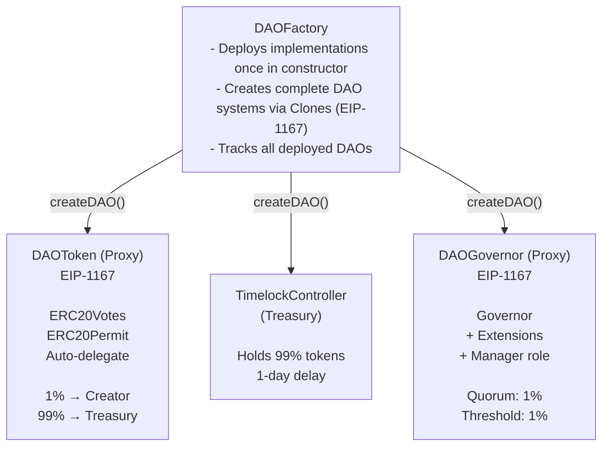

## What is CreateDAO?

CreateDAO is an open-source platform for deploying complete, independent DAO governance systems on EVM-compatible blockchains. Built on battle-tested **OpenZeppelin Governor** contracts, CreateDAO v2 provides a secure, standardized foundation for decentralized organizations.

Each DAO deployment includes three core components:
- **DAOToken** - ERC20 governance token with voting power (ERC20Votes)
- **DAOGovernor** - Proposal and voting management with OpenZeppelin extensions
- **TimelockController** - Secure treasury with execution delay

All three contracts are deployed in a single transaction via the **DAOFactory**, using the gas-efficient EIP-1167 minimal proxy (Clones) pattern.

## Why OpenZeppelin Governor?

Version 2 is a complete rewrite, rebuilt from the ground up using OpenZeppelin's industry-standard governance contracts instead of custom implementations. This brings:

- **Security**: Battle-tested, audited contracts trusted by the ecosystem
- **Compatibility**: Works seamlessly with existing governance tools (Tally, Defender)
- **Simplicity**: Proven patterns instead of custom logic
- **Standards**: Full compliance with governance standards (ERC-6372, ERC-5805)

## Key Features

### Auto-Delegation
Token holders automatically receive voting power when they receive tokens for the first time. No manual delegation step required - your tokens are ready to vote immediately.

### Secure Treasury
The TimelockController holds 99% of the token supply and acts as the DAO's treasury. All fund movements require governance approval and include a 1-day execution delay for security.

### Manager Role
Each DAO has an on-chain **Manager** address that can be queried via RPC. This role is designed for integration with DAO management platforms like **OpenBook** - providing on-chain authorization for off-chain operations.

The Manager address:
- Is set to the DAO creator at deployment
- Can only be changed through governance proposals
- Serves as the "on-chain source of truth" for operational authority
- Enables trusted individuals to manage day-to-day operations while maintaining transparency

**OpenBook Integration**: [OpenBook](https://openbook.so) is a transparent ERP/CRM/POS platform built specifically for DAOs managing Real World Assets. It uses the Manager role to verify authorization while providing complete financial transparency - all accounting data is public, ensuring accountability without voting fatigue.

### Gas Efficient
Using EIP-1167 minimal proxies, each new DAO costs significantly less gas to deploy. Token and Governor contracts are only 45 bytes each, with all logic delegated to shared implementation contracts.

### Token Distribution
- **1% to Creator**: Enables the creator to meet quorum and create initial proposals
- **99% to Treasury**: Held securely in the TimelockController, distributed through governance

## Architecture Overview

## Default Governance Settings

| Setting | Value | Description |
|---------|-------|-------------|
| Creator Allocation | 1% | Tokens sent to DAO creator (auto-delegated) |
| Treasury Allocation | 99% | Tokens held in TimelockController |
| Quorum | 1% | Minimum participation for valid proposals |
| Proposal Threshold | 1% | Tokens required to create proposals |
| Voting Delay | 1 day | Time before voting starts after proposal creation |
| Voting Period | 1 week | Duration of the voting period |
| Timelock Delay | 1 day | Execution delay after proposal passes |

All governance parameters can be updated later through governance proposals.

## Supported Networks

CreateDAO v2 is deployed on:
- **Base** (Mainnet)
- **Sepolia** (Testnet)

The DAOFactory uses deterministic CREATE2 deployment, enabling identical addresses across chains.

## Who is This Documentation For?

This documentation is intended for:

- **Community Leaders & Founders**: Launch a DAO for your project or organization
- **Developers**: Integrate with CreateDAO or build on top of it
- **DAO Members**: Understand how your CreateDAO-based organization functions
- **Anyone Curious About DAOs**: Learn about DAO architecture and the OpenZeppelin Governor pattern

## Open Source

All code is publicly available and open source:
- **Contracts Repository**: [createDAO/v2-core](https://github.com/createDAO/v2-core)
- **Interface Repository**: [createDAO/interface](https://github.com/createDAO/interface)
- **License**: MIT License

## Next Steps

<CardGroup cols={2}>
  <Card title="Getting Started" icon="rocket" href="/getting-started">
    Learn the basics and create your first DAO
  </Card>
  <Card title="DAOFactory Contract" icon="code" href="/contracts/dao-factory">
    Technical reference for the factory contract
  </Card>
  <Card title="Creating a DAO" icon="book" href="/tutorials/creating-dao">
    Step-by-step tutorial
  </Card>
  <Card title="Deployed Contracts" icon="map-pin" href="/deployed-contracts">
    Contract addresses on all networks
  </Card>
</CardGroup>
